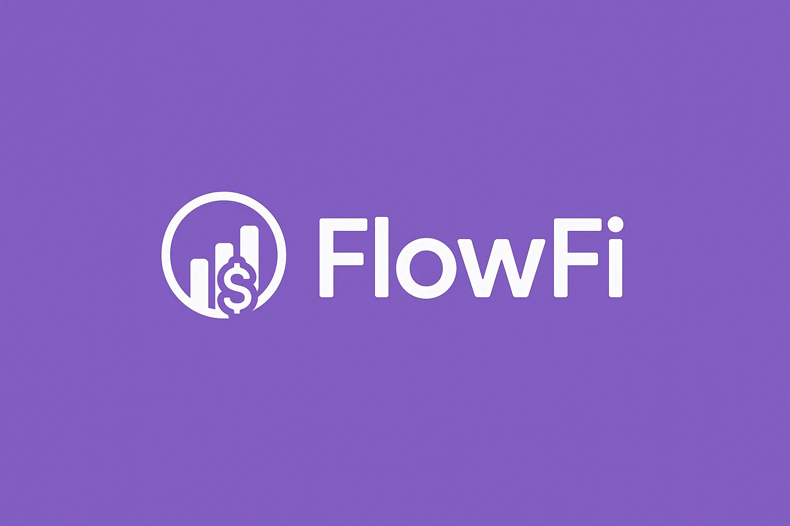
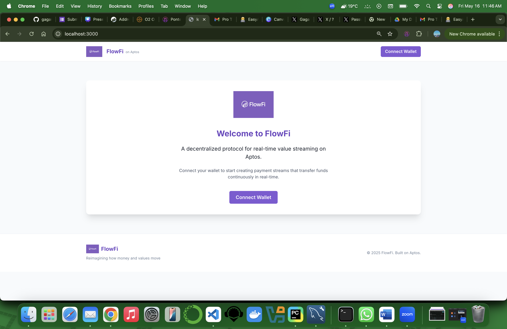
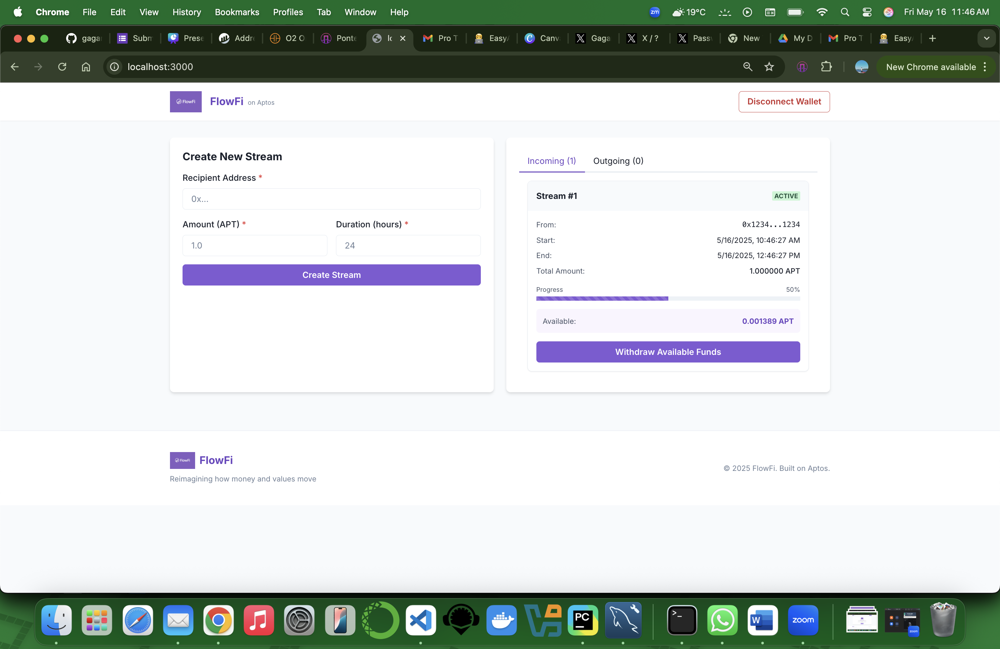
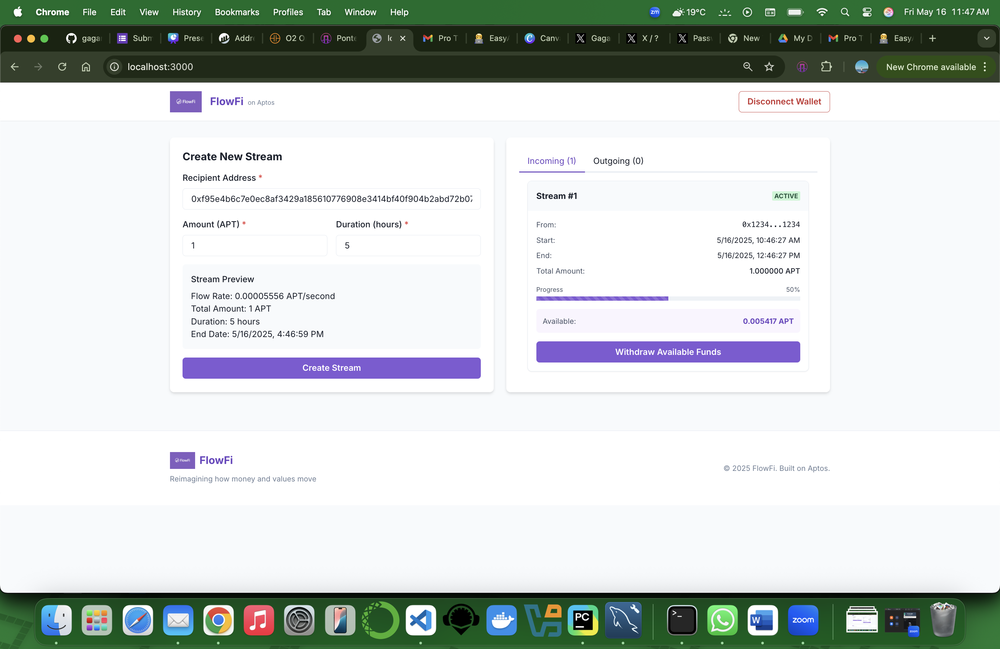

# FlowFi: Real-time Value Streaming on Aptos

<div align="center">
  
  <br/>
  <strong>Reimagining how money and values move</strong>
</div>

## Demo Video

[)
*Click the image above to watch the demo video*

## Overview

FlowFi transforms how value moves by enabling real-time, continuous fund transfers at per-second granularity. Instead of traditional batch-based payments (weekly payrolls, monthly subscriptions), FlowFi treats money as a fluid resource that flows continuously between parties.

## UI Screenshots

<div align="center">
  
  <p><em>FlowFi Home Screen with Wallet Connection</em></p>
  
  
  <p><em>Creating a New Value Stream</em></p>
  
  
  <p><em>Active Streams Dashboard with Real-time Progress</em></p>
</div>

## How FlowFi Interacts with Aptos Blockchain

FlowFi is built entirely on the Aptos blockchain, leveraging its powerful features:

### Smart Contract Architecture

FlowFi's contract consists of two main Move modules:

1. **FlowFi Module** (`flowfi.move`):
   - Handles stream creation, withdrawals, and cancellations
   - Manages escrow of funds during the stream lifecycle
   - Emits events for indexing and front-end updates
   - Provides view functions for querying stream data

2. **Stream Module** (`stream.move`):
   - Defines stream data structures and storage
   - Calculates stream rates and available amounts
   - Tracks stream status and withdrawal history

### Blockchain Interaction Flow

1. **Stream Creation**:
   - User connects Pontem wallet
   - Specifies recipient address, amount, and duration
   - Signs transaction creating stream resource on-chain
   - Funds are escrowed in the protocol
   - Stream begins transferring value at calculated rate

2. **Stream Withdrawals**:
   - Recipients calculate available funds in real-time
   - Initiate withdrawal transaction with their wallet
   - Smart contract verifies eligibility and transfers funds
   - Stream state is updated with new withdrawal amount

3. **Stream Cancellation**:
   - Stream creator initiates cancellation
   - Contract calculates streamed amount (sent to recipient) and remaining amount (returned to sender)
   - Stream is marked as cancelled and funds are distributed

### Aptos-Specific Technology Used

- **Move Language**: Resource-oriented programming for secure financial contracts
- **Block-STM**: Parallel execution engine enables efficient processing of micro-transactions
- **Pontem Wallet Integration**: Seamless authentication and transaction signing
- **Resource Accounts**: Secure escrow of streaming funds
- **Event System**: Tracking stream lifecycle events

## Technical Overview Video

[](https://www.youtube.com/watch?v=YOUR_TECHNICAL_VIDEO_ID)
*Click the image above to watch the technical overview and code walkthrough*

## Project Structure

```
flowfi/
├── move/                   # Move smart contracts
│   ├── sources/            # Contract source files
│   │   ├── flowfi.move     # Main protocol logic
│   │   └── stream.move     # Stream data and operations
│   └── Move.toml           # Move package configuration
└── frontend/               # Next.js frontend application
    ├── public/             # Static assets
    │   └── images/         # Logo and UI images
    ├── src/                # Source code
    │   ├── components/     # React components
    │   ├── hooks/          # Custom React hooks
    │   ├── pages/          # Next.js pages
    │   ├── services/       # API services
    │   ├── styles/         # CSS styles
    │   └── utils/          # Utility functions
    ├── .env.local          # Environment variables
    └── package.json        # Dependencies and scripts
```

## Getting Started

### Prerequisites

- [Aptos CLI](https://aptos.dev/cli-tools/aptos-cli-tool/install-aptos-cli/)
- [Node.js](https://nodejs.org/) (v14+)
- [Pontem Wallet](https://pontem.network/pontem-wallet) browser extension

### Smart Contract Deployment

```bash
cd move

# Compile the contract
aptos move compile --named-addresses flowfi=0xd4312ab48cb17ea05e6f7dd6719e7e28e04a3ce871e8ad7a92d50fba58d1ccb7

# Publish to testnet
aptos move publish --named-addresses flowfi=0xd4312ab48cb17ea05e6f7dd6719e7e28e04a3ce871e8ad7a92d50fba58d1ccb7 --profile flowfi

# Initialize the protocol
aptos move run --function-id 0xd4312ab48cb17ea05e6f7dd6719e7e28e04a3ce871e8ad7a92d50fba58d1ccb7::flowfi::initialize --profile flowfi
```

### Frontend Setup

```bash
cd frontend

# Install dependencies
npm install

# Start development server
npm run dev
```

Open [http://localhost:3000](http://localhost:3000) to view the application.

## Usage Guide

### Creating a Stream

1. Connect your Pontem wallet
2. Navigate to the "Create New Stream" form
3. Enter recipient address, amount, and duration
4. Submit and approve the transaction in your wallet
5. Your stream will begin immediately, transferring funds at the calculated rate

### Managing Streams

- **Monitoring**: Watch the real-time progress of your streams
- **Withdrawing**: Access available funds from streams sent to you
- **Cancelling**: Stop active streams you've created and recover remaining funds

## Core Features

- **Continuous Value Transfer**: Funds stream by the second rather than in batches
- **Real-time UI**: Visual representations of ongoing streams with live updates
- **Immediate Accessibility**: Recipients can withdraw available funds at any time
- **Capital Efficiency**: Money moves exactly when it needs to, not before or after
- **Programmable Flows**: Create streams with custom parameters and durations

## Technical Implementation

FlowFi leverages several innovative aspects of the Aptos blockchain:

1. **Move's Resource Model**: Treating streams as first-class digital resources with ownership guarantees
2. **High Transaction Throughput**: Enabling the micro-transactions needed for continuous streaming
3. **Low Latency Finality**: Ensuring near-instant confirmation of stream operations
4. **Event System**: Providing reliable updates about stream state changes

The smart contracts are designed with security as a priority, implementing proper access controls, mathematical safeguards, and comprehensive error handling.

## Future Roadmap

- Multi-token support beyond APT
- Advanced stream types (cliffs, vesting schedules)
- Conditional streams based on external triggers
- Cross-chain streaming via bridges
- Mobile application with push notifications

## Contract Addresses

- **Testnet**: `0xd4312ab48cb17ea05e6f7dd6719e7e28e04a3ce871e8ad7a92d50fba58d1ccb7`


## Team

- [Gagan V](https://github.com/gaganv007) - Developer

## Acknowledgments

- [Aptos Labs](https://aptoslabs.com/) for the blockchain infrastructure
- [Pontem Network](https://pontem.network/) for wallet integration
- [EasyA](https://twitter.com/EasyA_App) for the hackathon opportunity

*Note: This project was built during the EasyA Consensus Hackathon.*

